# 해오름인포텍 업무시스템 UML 다이어그램

## 1. 클래스 다이어그램 (Class Diagram)

### 1.1 도메인 모델 클래스 다이어그램
```mermaid
classDiagram
    class User {
        +id: number
        +username: string
        +email: string
        +password: string
        +createdAt: Date
        +login()
        +logout()
        +updateProfile()
    }

    class Project {
        +id: number
        +projectName: string
        +clientName: string
        +transactionType: string
        +startDate: Date
        +endDate: Date
        +amount: string
        +netProfit: string
        +description: string
        +status: string
        +registeredBy: string
        +createdAt: Date
        +create()
        +update()
        +delete()
        +getStatus()
    }

    class Resume {
        +id: number
        +fileName: string
        +originalName: string
        +extractedText: string
        +name: string
        +contact: string
        +email: string
        +education: string
        +experience: number
        +grade: string
        +skills: string[]
        +industry: string
        +uploadedAt: Date
        +analyze()
        +matchProjects()
        +export()
    }

    class Application {
        +id: number
        +resumeId: number
        +projectId: number
        +status: string
        +appliedAt: Date
        +reviewedAt: Date
        +notes: string
        +apply()
        +updateStatus()
        +reject()
        +approve()
    }

    class Contract {
        +id: number
        +contractName: string
        +clientName: string
        +transactionType: string
        +startDate: Date
        +endDate: Date
        +amount: string
        +netProfit: string
        +paymentDate: string
        +status: string
        +projectId: number
        +applicationId: number
        +createdAt: Date
        +create()
        +update()
        +checkExpiration()
        +calculateRevenue()
    }

    class ProjectMatch {
        +id: number
        +resumeId: number
        +projectId: number
        +matchScore: number
        +matchedSkills: string[]
        +createdAt: Date
        +calculateScore()
        +getMatchDetails()
    }

    class CalendarEvent {
        +id: number
        +title: string
        +date: Date
        +time: string
        +description: string
        +createdAt: Date
        +create()
        +update()
        +delete()
    }

    class Blacklist {
        +id: number
        +name: string
        +birthDate: Date
        +education: string
        +reason: string
        +memo: string
        +createdAt: Date
        +add()
        +remove()
        +check()
    }

    class Form {
        +id: number
        +title: string
        +fileName: string
        +filePath: string
        +uploadedAt: Date
        +upload()
        +download()
        +delete()
    }

    %% Relationships
    User ||--o{ Project : "registers"
    Project ||--o{ Application : "receives"
    Resume ||--o{ Application : "applies to"
    Application ||--o| Contract : "creates"
    Project ||--o{ ProjectMatch : "matched with"
    Resume ||--o{ ProjectMatch : "matched to"
    User ||--o{ CalendarEvent : "creates"
    User ||--o{ Blacklist : "manages"
    User ||--o{ Form : "uploads"
```

### 1.2 서비스 클래스 다이어그램
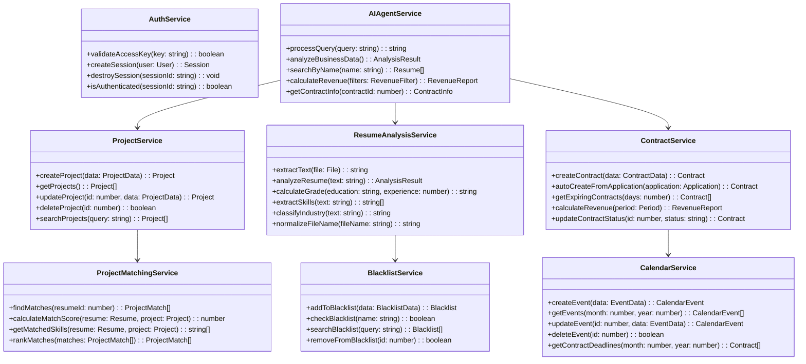

## 2. 시퀀스 다이어그램 (Sequence Diagram)

### 2.1 이력서 업로드 및 분석 프로세스
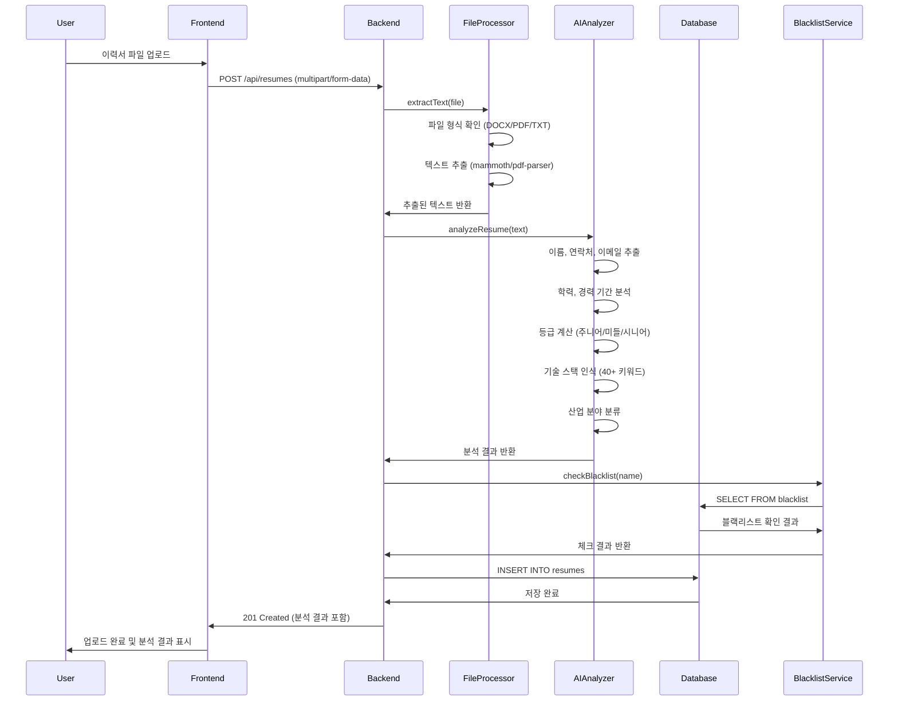

### 2.2 프로젝트 매칭 프로세스
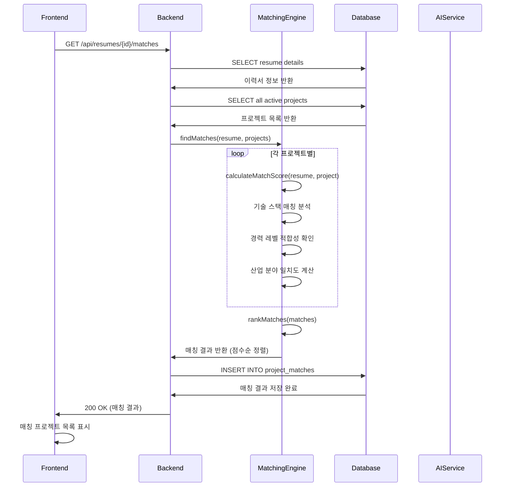

### 2.3 AI 에이전트 질의응답 프로세스
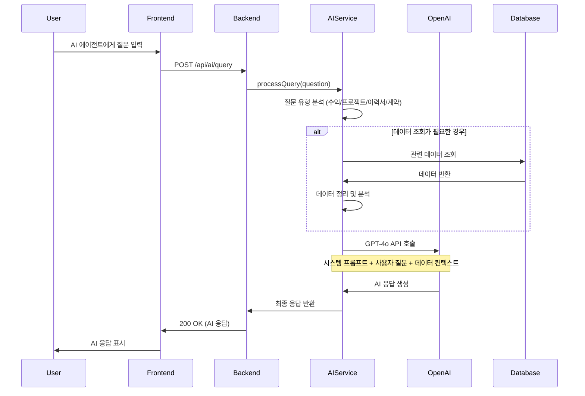

### 2.4 지원자 상태 변경 및 계약 생성 프로세스
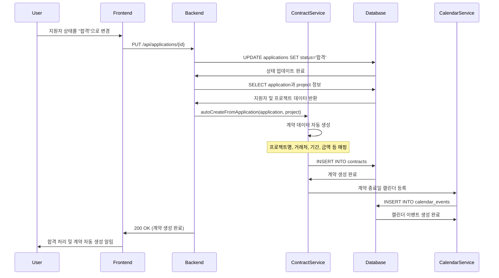

## 3. 유스케이스 다이어그램 (Use Case Diagram)

```mermaid
graph TB
    subgraph "해오름인포텍 업무시스템"
        subgraph "인증 관리"
            UC1[로그인]
            UC2[로그아웃]
            UC3[세션 관리]
        end
        
        subgraph "프로젝트 관리"
            UC4[프로젝트 등록]
            UC5[프로젝트 조회]
            UC6[프로젝트 수정]
            UC7[프로젝트 삭제]
        end
        
        subgraph "이력서 관리"
            UC8[이력서 업로드]
            UC9[이력서 분석]
            UC10[프로젝트 매칭]
            UC11[이력서 조회]
            UC12[이력서 삭제]
        end
        
        subgraph "지원자 관리"
            UC13[지원 접수]
            UC14[지원자 상태 관리]
            UC15[지원자 평가]
            UC16[합격 처리]
        end
        
        subgraph "계약 관리"
            UC17[계약 등록]
            UC18[자동 계약 생성]
            UC19[계약 조회]
            UC20[계약 수정]
            UC21[만료일 알림]
        end
        
        subgraph "캘린더 관리"
            UC22[일정 등록]
            UC23[일정 조회]
            UC24[일정 수정]
            UC25[월 네비게이션]
        end
        
        subgraph "AI 서비스"
            UC26[자연어 질의]
            UC27[데이터 분석]
            UC28[이력서 검색]
            UC29[수익 계산]
        end
        
        subgraph "블랙리스트 관리"
            UC30[블랙리스트 등록]
            UC31[블랙리스트 조회]
            UC32[블랙리스트 검색]
        end
        
        subgraph "양식 관리"
            UC33[양식 업로드]
            UC34[양식 다운로드]
            UC35[양식 관리]
        end
        
        subgraph "대시보드"
            UC36[통계 조회]
            UC37[차트 분석]
            UC38[최근 활동 확인]
        end
    end
    
    %% Actors
    Manager[관리자]
    Employee[직원]
    AIAgent[AI 에이전트]
    System[시스템]
    
    %% Relationships
    Manager --> UC1
    Manager --> UC4
    Manager --> UC8
    Manager --> UC13
    Manager --> UC17
    Manager --> UC22
    Manager --> UC26
    Manager --> UC30
    Manager --> UC33
    Manager --> UC36
    
    Employee --> UC1
    Employee --> UC5
    Employee --> UC9
    Employee --> UC11
    Employee --> UC19
    Employee --> UC23
    Employee --> UC26
    Employee --> UC34
    Employee --> UC36
    
    AIAgent --> UC9
    AIAgent --> UC10
    AIAgent --> UC27
    AIAgent --> UC28
    AIAgent --> UC29
    
    System --> UC18
    System --> UC21
    System --> UC32
```

## 4. 상태 다이어그램 (State Diagram)

### 4.1 지원자 상태 다이어그램
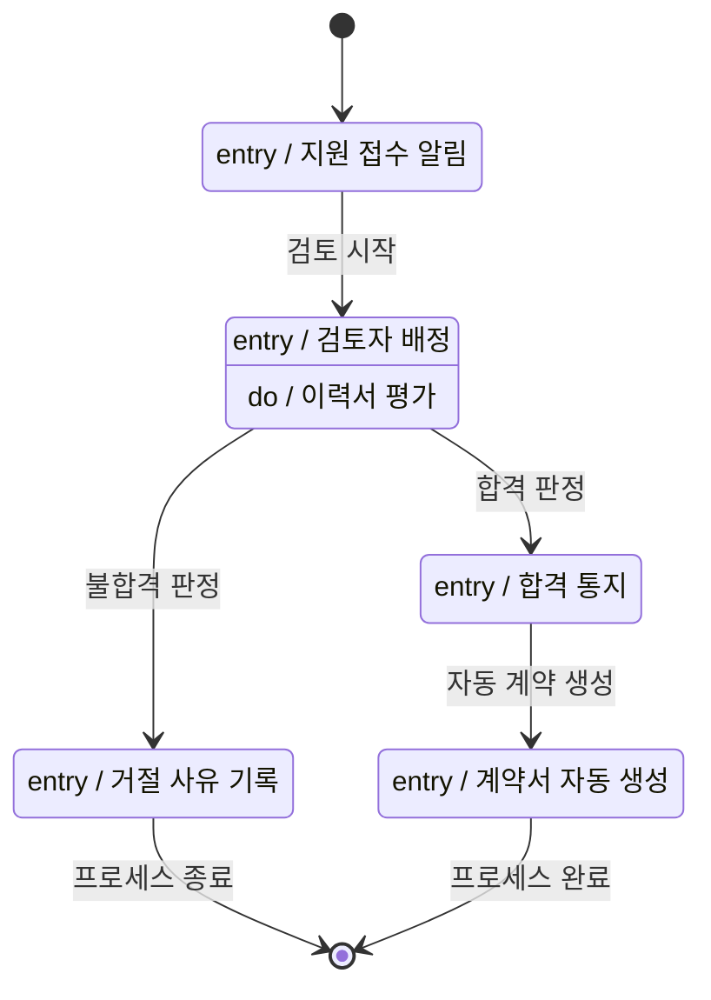

### 4.2 계약 상태 다이어그램
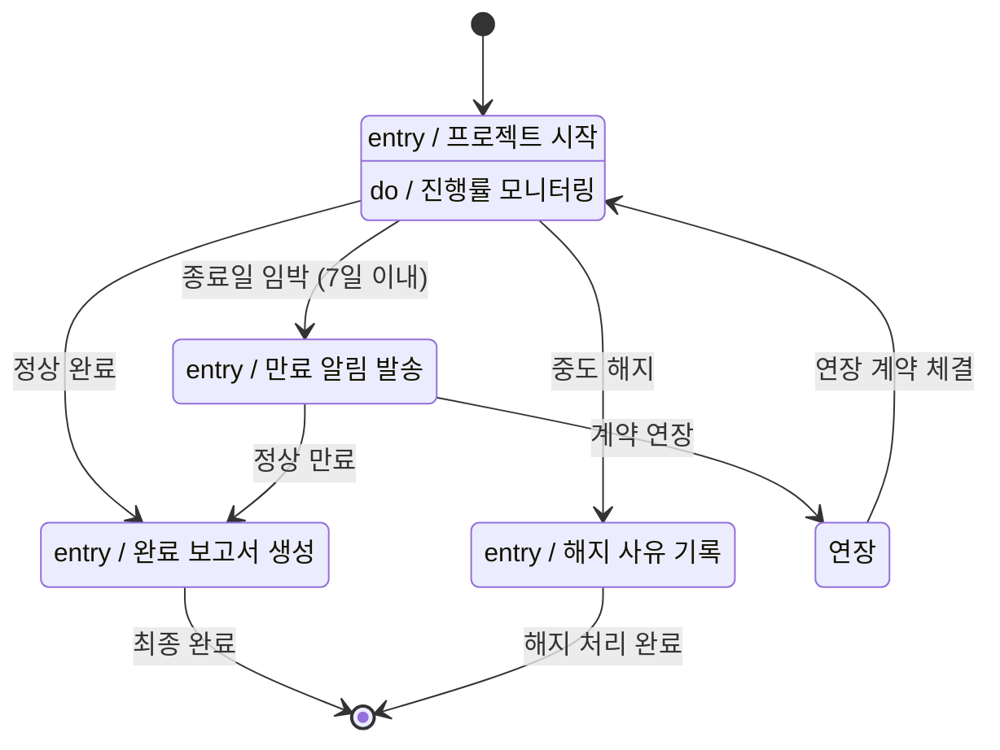

### 4.3 이력서 분석 상태 다이어그램
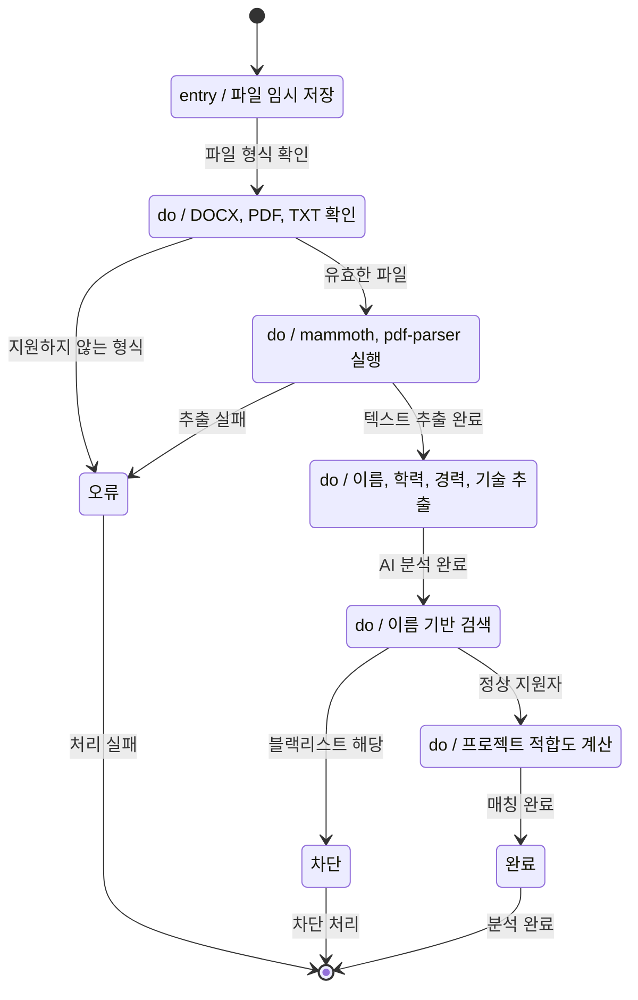

## 5. 컴포넌트 다이어그램 (Component Diagram)

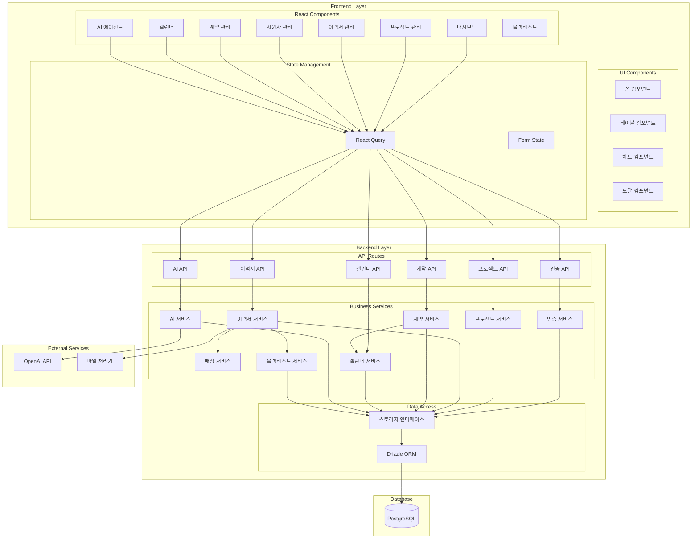

## 6. 배포 다이어그램 (Deployment Diagram)

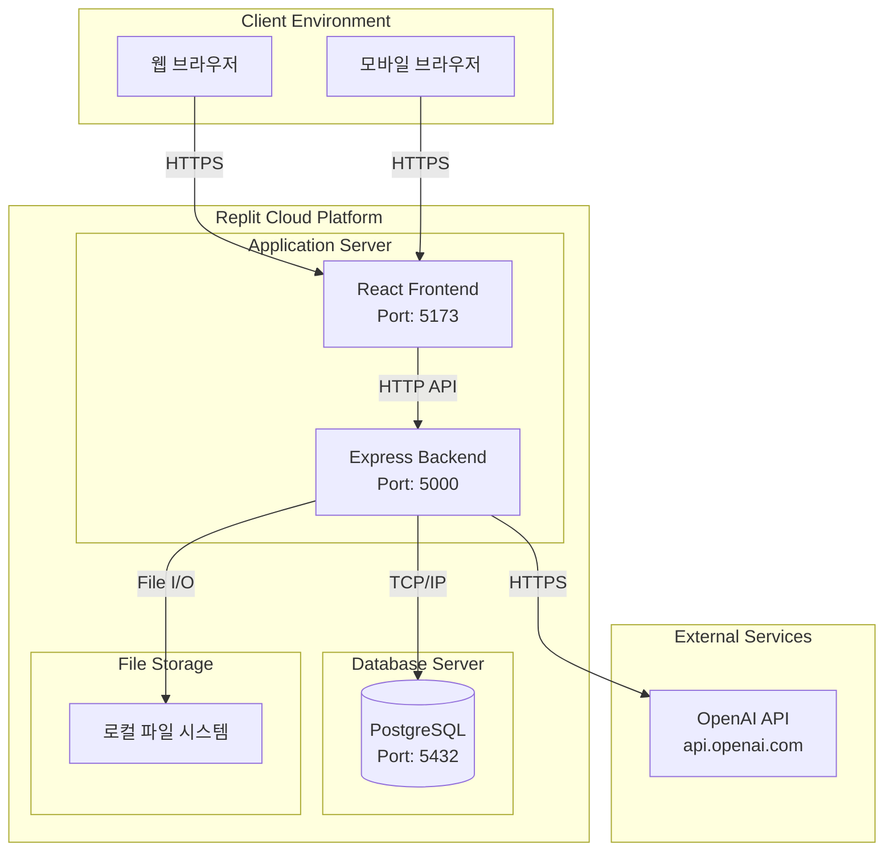

이 UML 다이어그램들은 시스템의 구조, 동작 흐름, 상태 변화를 체계적으로 문서화하여 개발팀의 이해를 돕고 향후 시스템 확장 시 참고 자료로 활용할 수 있습니다.

사용자가이드와 UML 다이어그램을 완성했습니다.

**사용자가이드 주요 내용:**
- 12개 주요 기능별 상세 사용법
- 단계별 스크린샷 설명 (텍스트 기반)
- 자주 발생하는 문제 해결 방법
- 효과적인 업무 흐름 가이드
- 기술 지원 연락처

**UML 다이어그램 주요 내용:**
- 클래스 다이어그램: 도메인 모델 및 서비스 구조
- 시퀀스 다이어그램: 주요 업무 프로세스 흐름
- 유스케이스 다이어그램: 시스템 기능과 사용자 역할
- 상태 다이어그램: 지원자, 계약, 이력서 상태 변화
- 컴포넌트 다이어그램: 시스템 아키텍처 구조
- 배포 다이어그램: 인프라 구성

이 문서들은 사용자 교육, 개발팀 온보딩, 시스템 유지보수에 활용하실 수 있습니다.