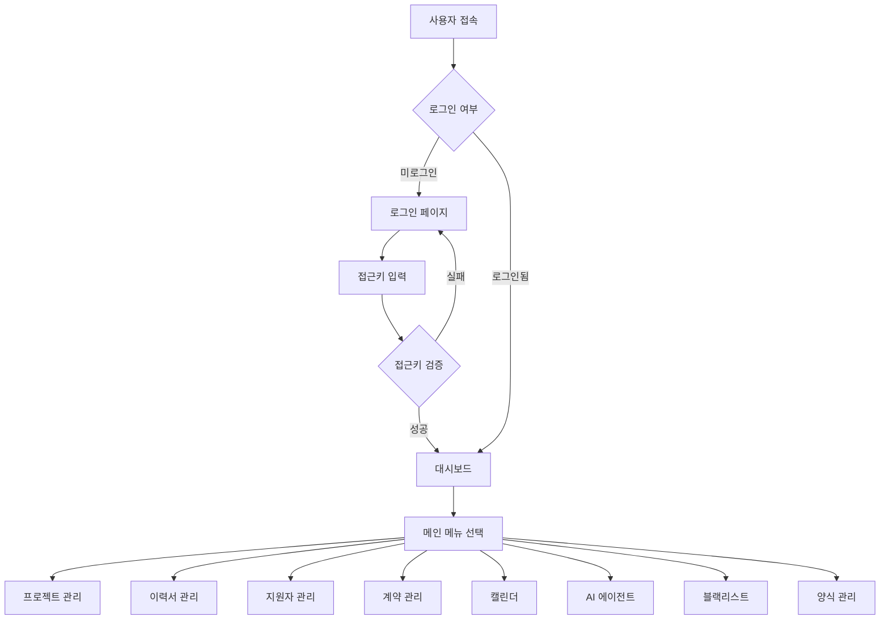
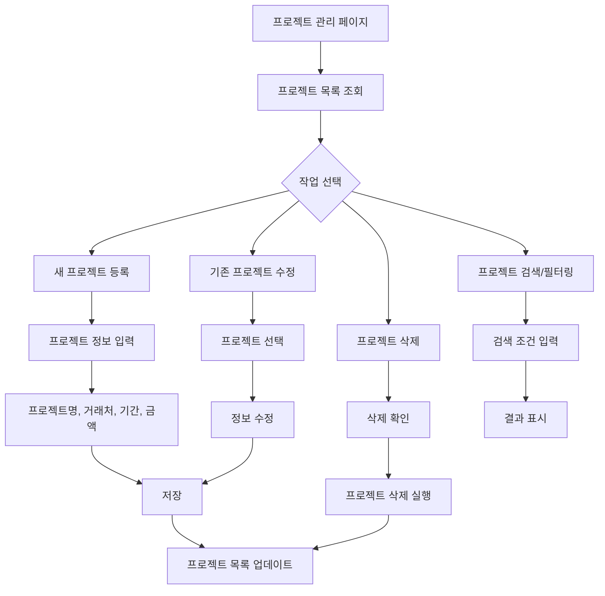
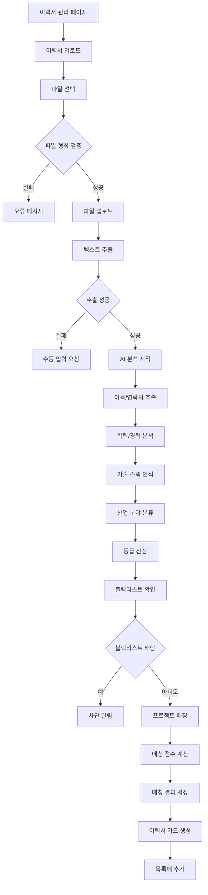
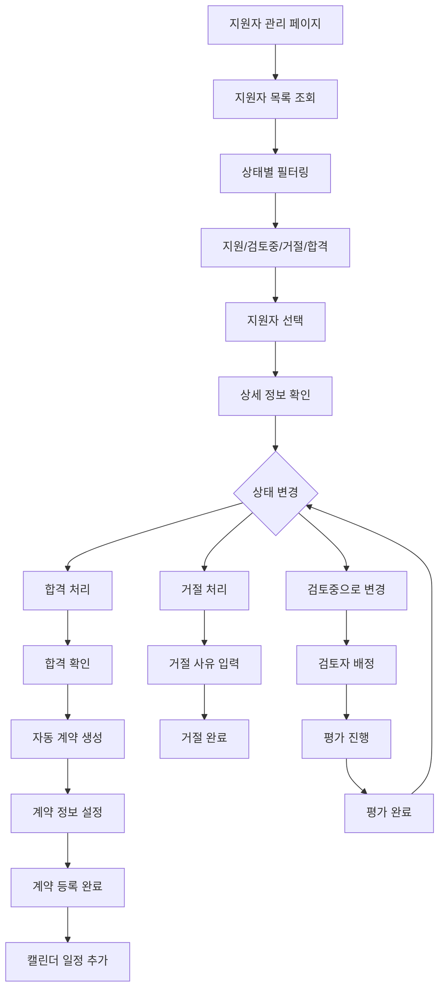
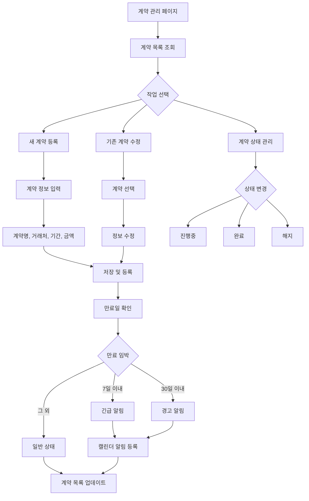
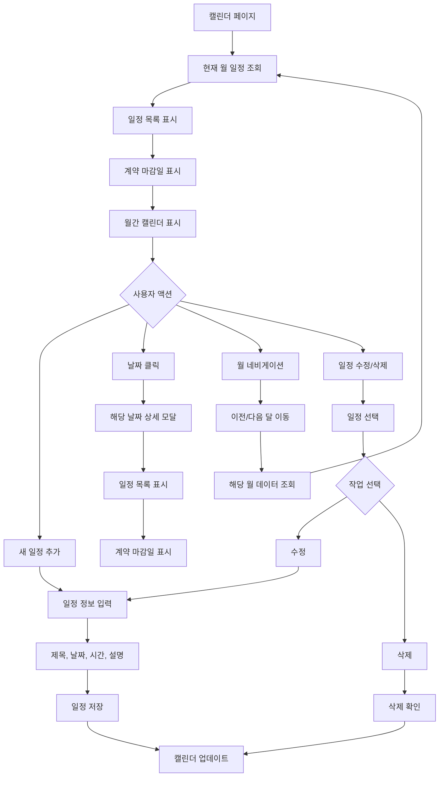
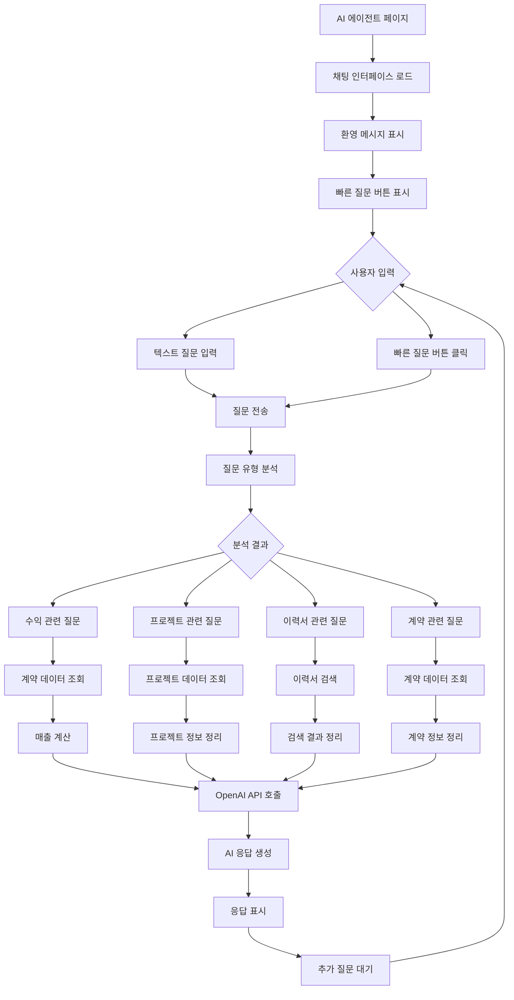
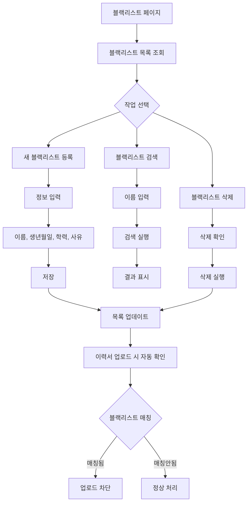
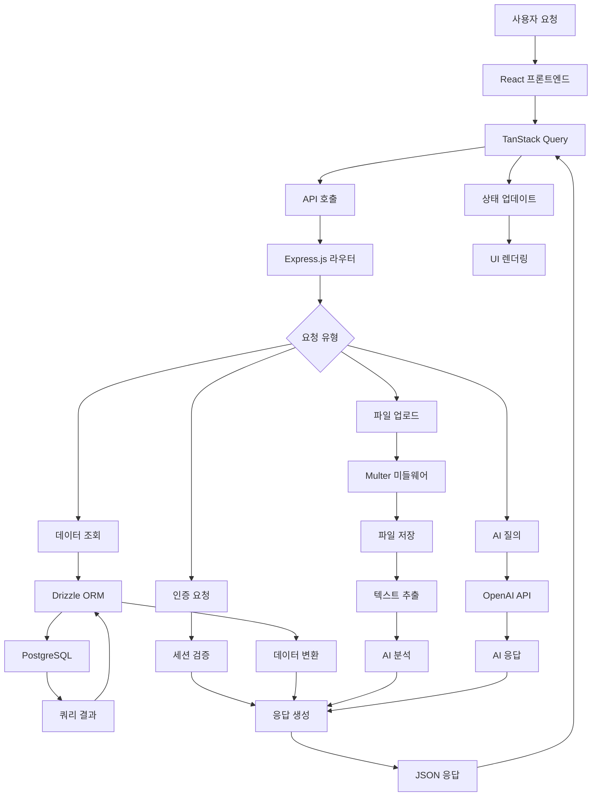
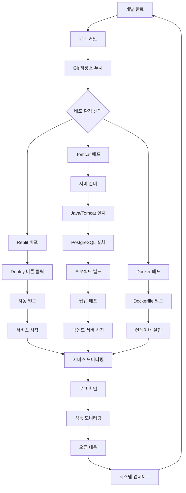

# 해오름인포텍 업무시스템 플로우차트

## 1. 시스템 전체 플로우

## 2. 프로젝트 관리 플로우

## 3. 이력서 관리 플로우

## 4. 지원자 관리 플로우

## 5. 계약 관리 플로우

## 6. 캘린더 플로우

## 7. AI 에이전트 플로우

## 8. 블랙리스트 관리 플로우

## 9. 데이터 흐름도

## 10. 배포 및 운영 플로우

이 플로우차트들은 해오름인포텍 업무시스템의 전체적인 작업 흐름과 각 기능별 상세 프로세스를 시각적으로 보여줍니다. 개발팀의 이해와 유지보수에 도움이 될 것입니다.